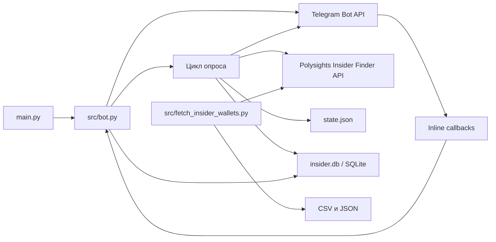

# Polysights Insider Bot

Асинхронный Telegram-бот на Python, который отслеживает сделки из Polysights Insider Finder и отправляет уведомления о них в заданный чат.

## Overview

Бот опрашивает API Polysights с фиксированными фильтрами, сохраняет сделки и метрики кошельков в локальную SQLite-базу и отправляет карточки новых сделок через Telegram Bot API. В карточке показывается Radar Score, а inline-кнопка открывает дополнительные метрики кошелька.

В репозитории также есть отдельный скрипт для выгрузки отфильтрованных кошельков в CSV и JSON. Это консольная утилита, она не запускает Telegram-бота.

## Features

- Опрос Polysights Insider Finder каждые 10 минут с фильтрами: от 0 до 5 уникальных рынков и WC/TX delta от 0 до 25 дней.
- При первом запуске — отправка до 25 самых свежих записей; в дальнейшем — записей с timestamp новее сохранённого состояния.
- Карточка сделки с Radar Score, данными сделки и кошелька, а также ссылками на Polymarket и Polygonscan.
- Inline-переход от карточки сделки к подробной карточке кошелька и обратно.
- Сохранение сделок, метрик кошельков и timestamp последней записи из API-выборки между перезапусками.
- Отдельная пакетная выгрузка кошельков в `insider_wallets.csv` и `insider_wallets.json`.

Уведомления отправляются в один чат, указанный через `TARGET_CHAT_ID`. Регистрация подписчиков и slash-команды в текущем коде не реализованы.

## Tech Stack

| Компонент | Технологии |
| --- | --- |
| Язык | Python 3.14+ |
| Telegram | aiogram 3, Telegram Bot API long polling |
| HTTP | aiohttp |
| Хранение | SQLite через aiosqlite |
| Конфигурация | python-dotenv |
| Управление зависимостями | uv, `pyproject.toml`, `uv.lock` |

Внешние сервисы: Polysights Insider Finder API и Telegram Bot API. Отдельный сервер базы данных не нужен.

## Architecture

`main.py` инициализирует приложение. `src.bot` создаёт схему SQLite и параллельно запускает получение обновлений Telegram и цикл опроса Polysights. Цикл опроса сохраняет сделки и метрики, затем отправляет уведомления. Обработчики inline-кнопок читают сохранённые данные и редактируют сообщение. Скрипт экспорта работает отдельно от бота.

`state.json` хранит максимальный timestamp из последней полученной выборки и служит водяным знаком для следующего опроса; `insider.db` хранит сделки и метрики кошельков. Оба файла создаются в текущей рабочей директории.



## Project Structure

| Путь | Назначение |
| --- | --- |
| `main.py` | Точка входа Telegram-бота |
| `src/bot.py` | Опрос API, расчёт Radar Score, форматирование сообщений и callback-обработчики |
| `src/db.py` | Инициализация SQLite и чтение/запись сделок и метрик кошельков |
| `src/fetch_insider_wallets.py` | Независимая пакетная выгрузка кошельков |
| `pyproject.toml`, `uv.lock` | Метаданные проекта и зафиксированные зависимости |
| `.python-version` | Версия Python для проекта: 3.14 |
| `.env.example` | Образец переменной `BOT_TOKEN`; остальные необходимые настройки нужно добавить самостоятельно |

## Requirements / Prerequisites

- Python 3.14 или новее.
- [uv](https://docs.astral.sh/uv/) для установки зависимостей и запуска команд проекта.
- Доступ к интернету для запросов к Polysights и Telegram.
- Telegram bot token и числовой ID чата, куда бот будет отправлять сообщения.

SQLite-файл создаётся приложением локально; отдельный сервис или миграционный инструмент не требуются.

## Installation

Из корня репозитория установите зависимости и создайте локальный файл окружения:

```bash
uv sync
cp .env.example .env
```

Затем отредактируйте `.env`: задайте настоящий токен бота и добавьте обязательный `TARGET_CHAT_ID`. Полный список настроек приведён ниже. Команды запускайте из корня репозитория, чтобы файлы состояния и базы данных находились в ожидаемом месте.

## Configuration

`src/bot.py` загружает `.env` при старте. Обязательные переменные читаются сразу при импорте модуля, поэтому бот завершится с ошибкой, если они отсутствуют или имеют неверный формат.

| Variable | Required | Description | Default |
| --- | --- | --- | --- |
| `BOT_TOKEN` | Да | Токен Telegram-бота, полученный у BotFather | Нет |
| `TARGET_CHAT_ID` | Да | Числовой ID единственного чата-получателя | Нет |
| `TARGET_THREAD_ID` | Нет | Числовой ID темы форума, если сообщения нужно отправлять в тему | Не задан; сообщения отправляются без ID темы |

Минимальная конфигурация `.env` выглядит так; замените значения-примеры своими:

```dotenv
BOT_TOKEN=your-token-from-BotFather
TARGET_CHAT_ID=your-numeric-chat-id
# TARGET_THREAD_ID=your-forum-topic-id
```

В текущем `.env.example` есть только `BOT_TOKEN`, поэтому `TARGET_CHAT_ID` нужно добавить в скопированный `.env`. Интервал опроса (10 минут), лимит первой отправки (25 записей) и фильтры Polysights заданы константами в `src/bot.py`, а не переменными окружения.

## Running the Project

Запустите Telegram-бота из корня репозитория:

```bash
uv run python main.py
```

При старте бот создаёт `insider.db`, если файла ещё нет, затем начинает принимать обновления Telegram и опрашивать Polysights. Остановить процесс можно через `Ctrl+C`. Уведомления содержат inline-кнопку для просмотра метрик кошелька; доступных slash-команд в коде нет.

## Database / State

SQLite-схема создаётся автоматически при запуске и хранится в `insider.db` в текущей директории. Таблицы `trades` и `wallets` содержат историю сделок и последние известные метрики кошельков. Таблица `users` также присутствует в схеме, но текущий бот не регистрирует в ней пользователей и не использует её для рассылки.

Максимальный timestamp из последней полученной выборки хранится отдельно в `state.json` и используется для поиска новых записей. Оба файла перечислены в `.gitignore`; сохраните их между перезапусками, если хотите сохранить локальную историю и позицию опроса.

## API

Собственного HTTP API проект не предоставляет. Бот отправляет GET-запросы к `https://www.polysights.xyz/api/insider-finder` с `batch=0`, `skipCount=true` и фиксированными параметрами фильтрации, затем обрабатывает элементы массива `data` в JSON-ответе.

Экспортёр использует тот же endpoint: сначала получает `totalCount`, затем запрашивает партии данных и формирует отдельные CSV- и JSON-файлы. Реализация запросов и преобразования данных находится в `src/fetch_insider_wallets.py`.

## Development

| Задача | Команда |
| --- | --- |
| Установить/синхронизировать зависимости | `uv sync` |
| Запустить бота | `uv run python main.py` |
| Запустить экспорт кошельков | `uv run python src/fetch_insider_wallets.py` |

Экспортёр создаёт `insider_wallets.csv` и `insider_wallets.json` в текущей директории; токен Telegram для него не требуется.
